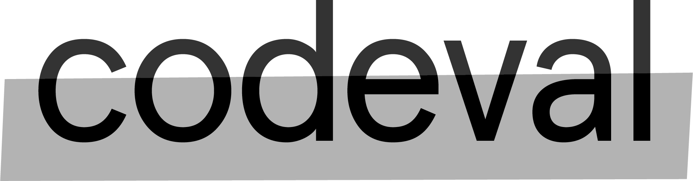

<p align="center">
  
</p>


Codeval is a first level tech interview platform, which provides complete flow from creation of your customized assessments to having detailed candidate assessment report with the scores. It has been designed around the needs of startups and boot-camps, where the automation of the first screening can drastically increase efficiency and help growth.

## Screenshots

<p align="center">
  
</p>


## Getting started

This is the front-end repository. The back-end can be found at : https://github.com/varnebla/thesis-backend

1. Clone the repo

```
git clone https://github.com/varnebla/thesis-frontend
```

2. Install dependencies
```
npm install
```

3. Start the front-end application
```
npm start
```


## Built with

* [React](https://reactjs.org/) - Front end library for building user interfaces.
* [React-Router](https://reacttraining.com/react-router/) - Declarative Routing for React.js.
* [Redux](https://redux.js.org) - Storage to share data inside the app.
* [Mocha](https://mochajs.org/) - JavaScript test framework.
* [Chai](https://www.chaijs.com/) - Chai is a BDD / TDD assertion library for Node.js.
* [Ace Editor](https://ace.c9.io/) - High Performance Code Editor for the Web.

## Contributing

Improvements are welcome!

Fork the repo and do your thing. Push to your fork and submit a pull request.


## Team

* Bernat Muntaner - [GitHub](https://github.com/bmuntper) - [LinkedIn](https://www.linkedin.com/in/bernat-muntaner-perello/)
* Germanas Miliuta - [GitHub](https://github.com/Gmiliuta) - [LinkedIn](https://www.linkedin.com/in/germanas-miliuta/)
* Gioacchino Grand - [GitHub](https://github.com/GioGrand) - [LinkedIn](https://www.linkedin.com/in/gioacchino-grand-full-stack-developer/)
* Victor Arnedo - [GitHub](https://github.com/varnebla) - [LinkedIn](https://www.linkedin.com/in/victor-arnedo-blanco/)


## License

This project is licensed under the MIT License.
